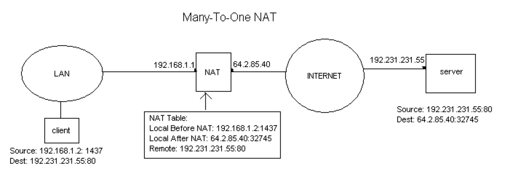
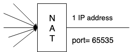
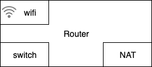
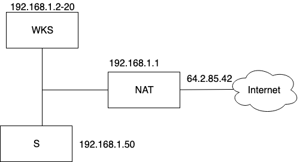

# Network Address Translation (NAT)

has 2 interfaces (2 routers)

## port number is important

2 deviced within nyu network request same network google.com at the same time

how does nyu network knows which device should receive the response coming back

NAT combines your unique local IP address and Port number, generate a Global IP address

## NAT multiple IP addresses

There are only 65535 ports in a NAT, but in NYU each device connect to the NAT has more than one connection and there are lots of devices.

NAT ran out of ports quickly, so it has to add more IP address.

In home network, every device has same global IP address, because home NAT only has one IP address

## DMZ (demilitarize zone)

isolate the server so protect other device in the network, keep server in router

## A typical router in a home network

## NAT subnet

