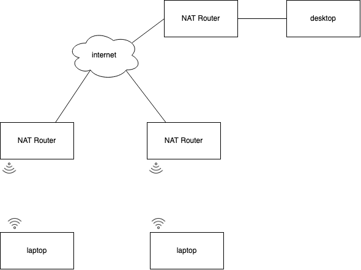

#### DNS server on the internet which reply to ping

ping 4.2.2.2

ping 8.8.8.8

## Question

how does NAT Router knows, the incoming connection, goes to which port?

## UPNP

Universal Plug and Play

Server request a NAT Router, router reply a port number

With UPnP, an application running in a host can request a NAT mapping between its (private IP address, private port number) and the (public IP address, public port number) for some requested public port number.

## Firewall

most common information by which a packet is evaluated:

- source ip address
- destination ip address
- ip protocol
- if tcp/udp the source and destination ports
- TCP flags; ICMP types/codes
- Layer 7 information

### Packet-filtering Firewalls

- Each packet is compared to a static list of rules defined by the administrator

- No info is stored from one packet to the next

#### Sections

> Implementing a packet filter

- input: prevent firewall itself being attacked
- forward
- output

#### Rules

the fewer the better

### Proxy firewall

- operate at layer 7 only
- all traffic will go through the proxy, even with https, not secured
- client only communicate with proxy server

### Stateful Inspection

only allow 10 half-open connection, can be attacked if the half-open connection fill up, inspection will fabercate a fake ack packet
