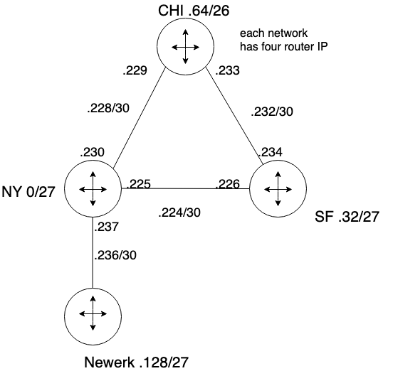
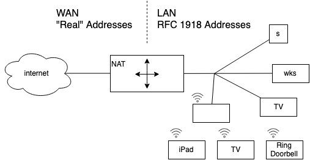

# Chapter 4.4

## Recap last class

### IP subnet mask

255.255.255.0/24

/24 = 255.255.255.0

/25 = ~.128 (1000 0000)

/26 = ~.192 (1100 0000)

/27 = ~.224 (1110 0000)

/28 = ~.240 (1111 0000)

/29 = ~.248 (1111 1000)

/30 = ~.252 (1111 1100)

| -----    | -        | -        | -       | mask |
| -------- | -------- | -------- | ------- | ---- |
| 11111111 | 11111111 | 11111111 | 1100000 | -    |
| 255      | 255      | 255      | 192     | /26  |
| 11111111 | 11111111 | 11111111 | 1110000 | -    |
| 255      | 255      | 255      | 224     | /27  |

### CIDR (Classless Inter-Domain Routing) route aggregation

The 32-bit IP address is divided into two parts and again has the dotted-decimal form a.b.c.d/x, where x indicates the number of bits in the first part of the address.

divide a large network into small ones

each part can has different size

#### ip addresses are divided into the portion below for different subnet

NY 1/8, SF 1/8, Chiacago 1/4, Other 1/2

can recombine later, but only one level back

#### CHICAGO Routing Table

| MT#        | mask | next host | metric |
| ---------- | ---- | --------- | ------ |
| 192.1.1.64 | /26  | -         | 1      |
| .228       | /30  | -         | 1      |
| .232       | /30  | -         | 1      |
| .0         | /27  | 230       | 2      |
| .0         | /27  | 234       | 3      |
| .32        | /27  | 234       | 2      |
| .32        | /27  | 230       | 3      |
| .128       | /27  | 234       | 2      |
| .128       | /27  | 230       | 4      |
| .230       | /30  | 230       | 3      |
| .230       | /30  | 234       | 4      |
| .224       | /30  | 234       | 3      |
| .224       | /30  | 234       | 3      |

### IP broadcast address

When a host sends a datagram with destination address **255.255.255.255**, the message is delivered to all hosts on the same subnet. Routers optionally forward the message into neighboring subnets as well (although they usually don’t).

### Assgin IP address to Router

A system administra-tor will typically manually configure the IP addresses into the router (often remotely, with a network management tool)

### Assgin IP address to Host

can do it manually, but **DHCP** is widely used

### Dynamic Host Configuration Protocol (DHCP)

DHCP allows a host to obtain (be allocated) an IP address automatically.

A network administrator can configure DHCP so that a given host receives the same IP address each time it connects to the network, or a host may be assigned a temporary IP address that will be different each time the host connects to the network

DHCP also allows a host to learn additional information, such as its subnet mask, the address of its first-hop router (often called the default gateway), and the address of its local DNS server.

#### DHCP server discovery

Client sends within a UDP packet to port 67, DHCP client creates an IP datagram containing its DHCP discover message along with the broadcast destination IP address of 255.255.255.255 and a “this host” source IP address of 0.0.0.0

#### DHCP server offer

A DHCP server receiving a DHCP discover message responds to the client with a DHCP offer message that is broadcast to all nodes on the subnet, again using the IP broadcast address of 255.255.255.255.

### DHCP client-server interaction

- client discover
- server offer
- client request
- server ack

## Network Address Translation

### RFC1918

Not connected network

