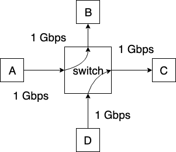
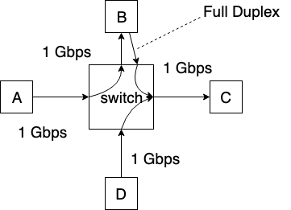
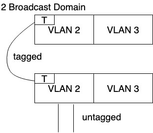

# ARP: address resolution protocol

> how to determine interface's MAC address knowing IP address

## same LAN

easy

ARP packet: if tuple not in ARP table, query to other router, asking "what is the MAC of this IP"

## routing to another LAN

DHCP tells device the router's IP address

A -------> interface 1 - Router - interface 2 --------> B

on layer3, dst IP address is the the device you want to connect

on layer 2, dst mac address is the nearest Router interface MAC address

when it reaches the router, layer2 frame is removed, left only the layer 3 info and above, and start a new MAC data gram, src MAC is the another Router interface dst MAC address now is the true destination

There is no way for B to find out A's MAC address

### IPv6

MAC address is embeded in IP address, use a IP prefix

## Ethernet

A **hub** is a physical-layer device that acts on individual bits rather than frames. When a bit, representing a zero or a one, arrives from one interface, the hub simply re-creates the bit, boosts its energy strength, and transmits the bit onto all the other interfaces

Like a bus, run around and pick up data within your network, if someone in the network cut the terminator, whole network is down

Ethernet with a hub-based star topology is also a broadcast LAN

Use **switch** at the center of star topology

unlike **routers**, which operate up through layer 3, a **switch** operates only up through layer 2.

connectionless, unreliable

### Ethernet frame structure

- preamble: 8 bytes in total

starts with byte 10101010 ends with byte 10101011

The first 7 bytes of the preamble serve to “wake up” the receiving adapters and to synchronize their clocks to that of the sender’s clock

- Data field (46 to 1,500 bytes)
- source address
- dst address
- type field
- Cyclic redundancy check

### 802.3 Ethernet standards

based on

- speeds: 2Mbps 10Mbps, 100M 1G 10G and
- physical layer media: fiber copper

## Ethernet Switch/ Link Layer Switch

The role of the switch is to receive incoming link-layer frames and forward them onto outgoing links

- **Filtering** is the switch function that determines whether a frame should be for-warded to some interface or should just be dropped.
- **Forwarding** is the switch function that determines the interfaces to which a frame should be directed, and then moves the frame to those interfaces.

examine incoming frame's MAC address, selective forward frame to one-or-more outgoing links when frame is to be forwarded on segment, uses CSMA/CD to access segment

switch is trasparent, no need to configure it

avoid the race of resources, bottoleneck

### Swtich table

| MAC addr | interface | TTL |
| -------- | --------- | --- |
| A        | 1         | 60  |
| A'       |

contains...

1. a MAC address
2. the switch interface that leads toward that MAC address
3. the time at which the entry was placed in the table

for different situation:

- no entry is found for the incoming MAC address, sending it to all interfaces(broadcast)
- data sent to itself, discarding the frame
- find an entry, forward it

switches can be connected together to

### Self learning

save the entry automatically when it receive frame from unknown address

broadcasting domain: if MAC address is not saved, it will boradcast across the whole switches system, each switch will remember and next time each switch can avoid this transfer

## VLANs: virtual LANs

a switch that supports VLANs allows multiple virtual local area networks to be defined over a single physical local area network infrastructure.

seperate different brodcast domain

different ports are designated for a group of devices, prevent cross communication

e.g ports 1 - 8 can only reach ports 1 - 8

a table of port-to-VLAN mappings is maintained within the switch; and switch hardware only delivers frames between ports belonging to the same VLAN.

### Dynamic membership

ports can be dynamically assigned among VLANs, detects the MAC address and assign it as Phone VLAN

### Forwarding between VLANS

if cross communication, send it via switch

An IP datagram going from the EE to the CS department would first cross the EE VLAN to reach the router and then be forwarded by the router back over the CS VLAN to the CS host

e.g phone VLAN and data VLAN

### VLAN trunking

problem: what if a wire is both A and B VLAN

The IEEE has defined an extended Ethernet frame format, 802.1Q, for frames crossing a VLAN trunk

### 802.1 VLAN tagging

Tag Protocol Identifier (TPID) field (with a fixed hexadecimal value of 81-00), a 2-byte Tag Control Information field that contains a 12-bit VLAN identifier field, and a 3-bit priority field that is similar in intent to the IP datagram TOS field.

trunk port: handle all traffic between switches, can forward all VLAN in one swtiche to another

send untagged packet by default, VLAN #1
