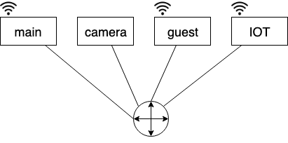

# VLAN continue

## 802.1 Q VLAN frame format

add two fields:

- 2-byte Tag Protocol Identifier (value:81-00)
- Tag Control information (12 bit VLAN ID field, 3 bit priority filed like IP TOS)

before type filed

### VLAN enable

|     |     |     |     |     |     |     |     |     |     |
| --- | --- | --- | --- | --- | --- | --- | --- | --- | --- |
| -   | -   | 30  | 30  | 30  | -   | -   | -   | -   | -   |

goes to Router ----> Internet

### without VLAN

# Ch 6: Wireless and Mobile Networks

for others to find you

stay connected even if you move around

## wireless link

used to connect mobiles to base station

802.1x: indoor

CDMA, 4G LTE, 5G: outdoor/mid-range outdoor/long-range outdoor

802.11n: 200Mbps

4G: 5-11 Mbps

## ad hoc mode

bluetooth

- no base stations
- point to point

## Wireless Link Characteristics

- decreased signal strength
- interference from other sources (2.4 GHz)
- multipath propagation: reflection of signal

## CDMA (Code Division Multiple Access)

choosing which sequence to transmit data based on chip sequence

as long as sender and receiver know the code, receiver would know the segregation
